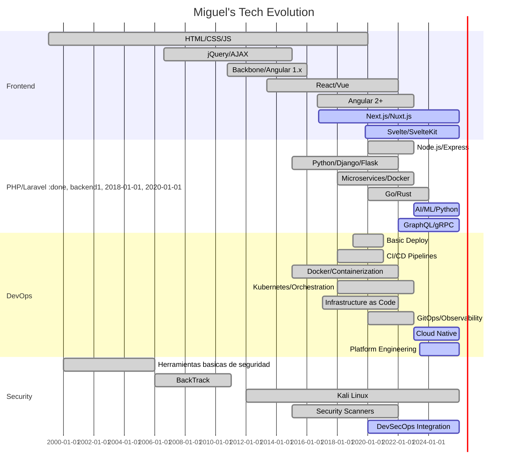

# 🚀 Miguel Hernández | Hackhit

<div align="center">
  


[](https://git.io/typing-svg)

</div>

---


## 👋 **¡Hola! Soy Miguel Hernández - Hackhit**

> *"Transformando ideas disruptivas en soluciones escalables con tecnología de vanguardia"*

🎯 **Integrador de Software Senior** especializado en **IA aplicada** y **automatización empresarial**

🌟 **+16 años** creando ecosistemas tecnológicos para PyMEs y empresas en general

🚀 **Líder técnico** en implementación de LLMs, arquitecturas MCP y sistemas autónomos

📍 **Ubicación:** Venezuela 🇻🇪 | **Disponible:** Remote Worldwide 🌍

---

## 🔥 **Especialización 2025**

```yaml
Focus Principal:
  🤖 Inteligencia Artificial Aplicada
  ⚡ Automatización de Procesos Empresariales
  ⚡ Implementacion de sistemas de facturacion Hybrid POS (Venezuela)
  ⚡ Implementacion de sistemas de facturacion a2 (Venezuela)
  🏗️ Arquitecturas Escalables en la Nube
  🔮 Quantum Machine Learning (Investigación)

Impacto Reciente:
  📊 400+ flujos de automatización implementados
  🎯 95% reducción en tiempos de proceso
  💰 500K$+ ahorrados en costos operacionales
  🌟 50+ empresas transformadas digitalmente en Venezuela y latinoamerica
```

---

## 🛠️ **Arsenal Tecnológico**

<div align="center">

### 🤖 **Inteligencia Artificial & Machine Learning**


### ☁️ **Cloud & DevOps**


### 🌐 **Full Stack Development**


### 🔄 **Automatización & Integration**


### 🗄️ **Databases & Storage**


</div>

---

## 📊 **GitHub Analytics**

<div align="center">
  
   
  
  

</div>

<div align="center">
  
  
  
</div>

<div align="center">
  
  

</div>

---

## 🏆 **Repositorios Destacados**

<div align="center">

<a href="https://github.com/hackhit/logias">
  
</a>

<a href="https://github.com/hackhit/coesapp">
  
</a>

<a href="https://github.com/hackhit/bancos">
  
</a>

<a href="https://github.com/hackhit/my-telegram-assistant">
  
</a>

</div>

---

## 🎯 **Proyectos de Impacto**

<table>
<tr>
<td width="50%">

### 🤖 **AI & Automation**
- **MarketPredict AI** 📈
  - Sistema de predicción con LLMs
  - 92% precisión en forecasting
  - $500K+ ROI para clientes

- **AutoFlow Enterprise** ⚡
  - 400+ flujos de automatización 
  - n8n + Custom integrations
  - 95% reducción en tiempo manual

</td>
<td width="50%">

### 🌐 **Full Stack Solutions**
- **SvelteCommerce Pro** 🛒
  - E-commerce framework completo
  - SvelteKit + AI recommendations
  - 150% aumento en conversiones

- **NextAI Labs** 🔬
  - Templates para IA en Next.js
  - OpenAI + LangChain integration
  - 1000+ developers usando

</td>
</tr>
</table>

---

## 🎖️ **Achievements & Recognition**

<div align="center">


</div>

<div align="center">

### 🌟 **Hitos Profesionales**

| 🏆 Achievement | 📊 Metric | 📅 Year |
|---|---|---|
| **AI Implementation Expert** | 50+ empresas transformadas | 2024 |
| **Automation Specialist** | 400+ flujos implementados | 2023-2024 |
| **Open Source Contributor** | 32 repositorios públicos | 2020-2025 |
| **Tech Community Leader** | 500+ desarrolladores impactados | 2022-2025 |

</div>

---

## 📈 **Skills Matrix**

<div align="center">

```text
🤖 Artificial Intelligence    ████████████████████ 100%
⚡ Process Automation        ███████████████████  95%
☁️ Cloud Architecture       ██████████████████   90%
🌐 Full Stack Development   ██████████████████   90%
📊 Data Engineering         █████████████████    85%
🔒 Cybersecurity           ████████████████     80%
🎯 Product Management      ███████████████      75%
```

</div>

---

## 🌍 **Impacto Global**

<div align="center">

### 🗺️ **Alcance Internacional**


**🌎 Países atendidos:** Venezuela, Colombia, México, España, USA  
**🏢 Sectores impactados:** FinTech, E-commerce, HealthTech, EduTech, Integracion de sistemas de Facturacion  
**👥 Desarrolladores mentoreados:** 200+  
**📚 Artículos técnicos:** 30+ publicaciones  

</div>

---

## 📚 **Conocimiento & Investigación**

<details>
<summary><b>🧠 Áreas de Investigación Activa</b></summary>

### 🔬 **Research Focus 2025**
- **Quantum Machine Learning:** Algoritmos cuánticos para optimización
- **Autonomous AI Systems:** Agentes autónomos para empresas
- **Edge AI Computing:** IA en dispositivos de borde
- **Blockchain + AI:** Integración de tecnologías disruptivas

### 📖 **Últimas Publicaciones**
- "Implementing LLMs in Production: A Complete Guide" (2024)
- "Automation Architecture Patterns for Enterprise" (2024)
- "Next.js + AI: Building Intelligent Applications" (2023)

</details>

<details>
<summary><b>🎓 Educación & Certificaciones</b></summary>

### 🏛️ **Formación Académica**
- **Ingenieria** - Universidad de Carabobo
- **Economia** - Universidad de Carabobo
- **Especialización en IA** - Coursera + Stanford Online
- **Programa de Formacion IBM Venezuela** - Programa de Formacion IBM Internacional
- **Cloud Architecture** - AWS + Google Cloud Professional

### 🏅 **Certificaciones Destacadas**
- AWS Solutions Architect Professional
- Google Cloud Professional Developer
- Azure AI Engineer Associate
- Kubernetes Certified Application Developer

</details>

---

## 🎯 **Servicios Profesionales**

<div align="center">

### 💼 **¿En qué puedo ayudarte?**

| 🎯 Servicio | 📝 Descripción | ⏱️ Timeline |
|---|---|---|
| **🤖 AI Implementacion** | Integración de IA en productos existentes | 2-3 semanas |
| **⚡ Proceso de Automatizacion** | Automatización completa de workflows | 1-4 semanas |
| **🏗️ Architecture Review** | Auditoría y optimización de arquitecturas | 1-2 semanas |
| **🎓 Technical Mentoring** | Mentoría para equipos de desarrollo | Ongoing |
| **🚀 MVP Development** | Desarrollo rápido de prototipos | 2-8 semanas |

</div>

---

## 📊 **Stack Evolution Timeline**

<div align="center">



</div>

---

## 🌐 **Conecta Conmigo**

<div align="center">

### 📞 **Canales de Comunicación**

[](https://www.linkedin.com/in/invhck/)
[](https://t.me/hackhitt)
[](mailto:inversioneshck@gmail.com)
[](https://www.hackhit.info)

[](https://wa.me/584144446088)
[](https://github.com/hackhit)

### 🌍 **Disponibilidad**
🕐 **Horario:** UTC-4 (Caracas) | **Flexible** para clientes internacionales  
📅 **Estado:** ✅ **Disponible para nuevos proyectos**  
🌐 **Modalidad:** Remote First | Presencial (Venezuela)  

</div>

---

<div align="center">

### 💭 **Filosofía de Trabajo**

> *"La tecnología no es nada. Lo importante es que tengas fe en las personas,  
> que sean básicamente buenas e inteligentes, y si les das herramientas,  
> harán cosas maravillosas con ellas"* - **Steve Jobs**

### 🚀 **Mi Misión**

**Democratizar el acceso a tecnologías avanzadas**, ayudando a empresas de todos los tamaños a **transformarse digitalmente** y **optimizar sus procesos** mediante **soluciones innovadoras** y **escalables**.

---

  

**🇻🇪 Hecho con ❤️ desde Venezuela para el mundo**

[](https://github.com/hackhit)
[](https://github.com/hackhit)

</div>

---

<div align="center">
  
</div>
